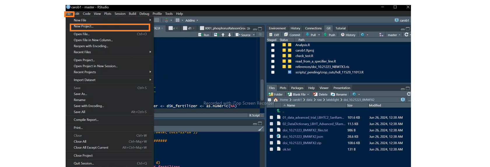
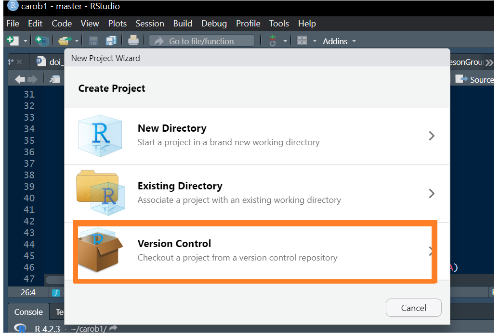
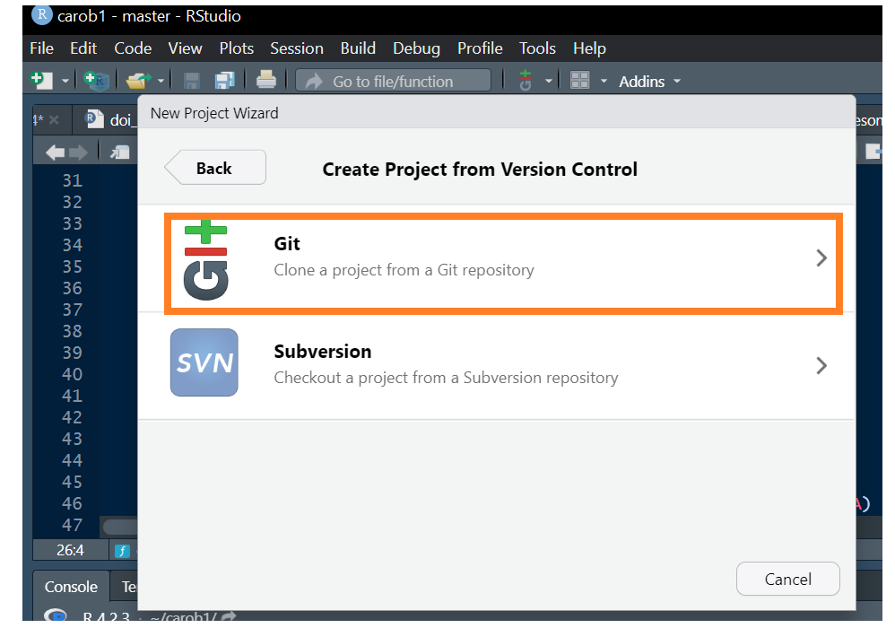
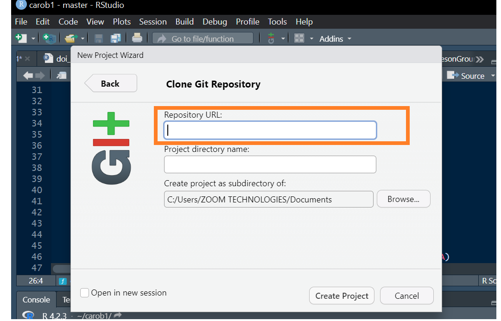
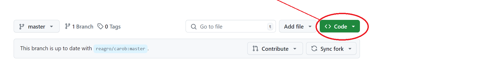
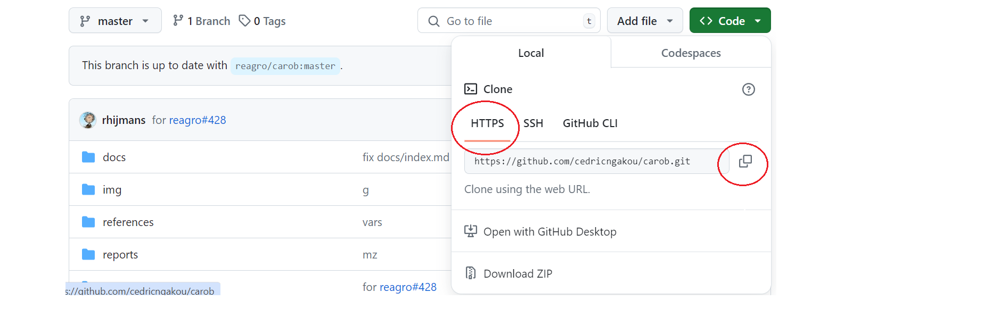
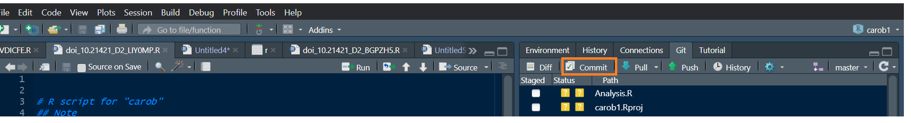
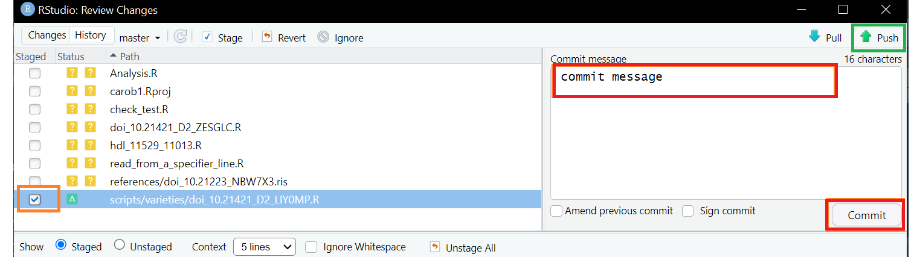

:orphan:

R-Studio
========

clone
-----

To clone the repository, just follow the steps below:

1. Open R Studio
2. Click on the **file** button at the top left of the window then on **New project..** button as shown on the image below.

3. Click on git version control as shown on the image below.

4. In the new windows click on **clone a project from Git repository**.
   See the image below.

5. Specifies the URL of the remote repository(your forked copy of Carob) and the communication protocol (use https).

Specifier the name of the folder on your local machine where the repository will be downloaded into. If this option is not specified, Git
will simply create a new folder named after the remote repository. To get the URL, you will go to your remote repository and follow the step below:

Now you have your local copy of carob and you can start contributing.

pull
----

Before you do any work, you should check that your *remote repo* (your forked version on github) is not *behind* main repo (`carob-data/carob <https://github.com/carob-data/carob>`__) if so, you should *sychronize* your github hosted clone with the main repo. Now you can "pull" the latest version to your local repo.  

add
---

.

commit
------

When you make a commit, you must include a commit message that briefly describes the changes. The simplest way to commits your change is by
clicking on ``git``, then on the **commit button** at the top (right box) of the RStudio Graphical User Interface (GUI):

 
 
Select ( *ballot box with check* ) the data sets you want to *commit* in the box on the left of the window, then write your commit message in the
new window and click on the **commit button** (see the image bellow).

 
push
----

Once you have committed your change, you can now `push` the commited changes in your local repo to the remote repo of your fork.

By clicking on **push button** (:arrow_u:), you will move your *changes* to your *remote* repository. We recommend using the RStudio GUI for new
users. Once you will be familiarize with the process, you will then choose the method that suits you best to push your change.

Once the dataset is ready, and your script is working, you now need to ``push`` your contribution into the main Carob repository
(`carob-data/carob <https://github.com/carob-data/carob>`__). The section below will show you a guideline on how to contribute there.

