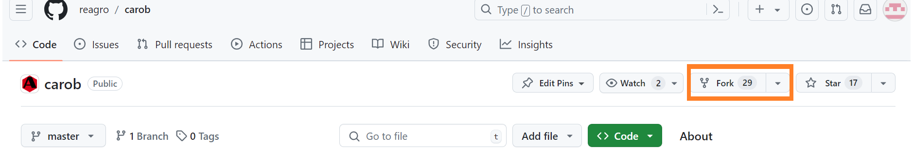
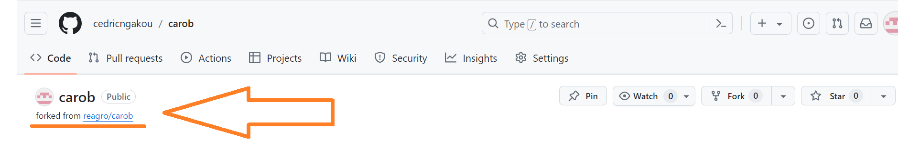
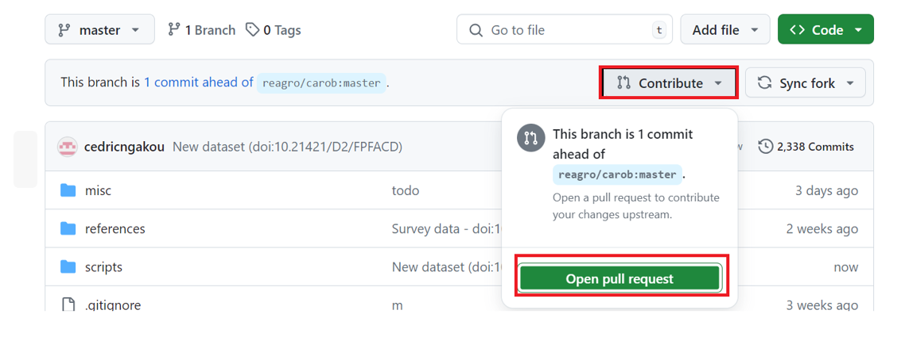
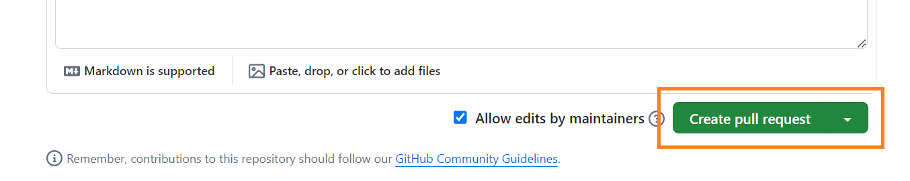

.. raw:: html

   

git
===

.. raw:: html

   

   

The *Carob* project is developed using the "git" versioning software. This greatly facilitates collaborative work and making incremental improvements because all changes made are tracked. A git project is called a "repo" (repository) and the "master" (main) Carob repo is `hosted on github <https::/github.com/reagro/carob>__ . 

To contribute to the *Carob* repo (and to other github based projects) you need to understand a few concepts and commands that we introduce here. 

The first thing you need to do is create an account on github (other projects using git may use another platform such as bitbucket). Once you have an account, you can **fork** the *Carob* repo to your account. A fork is a copy of a git repo that you can make changes to while also getting any updates that are made to the main repo. 

fork
----

To fork the *Carob* repo, navigate to the `Carob github page <https::/github.com/reagro/carob>`__, click on the **Fork** button and choose your personal account as the target.

The forked repo will then be added to your github account. The text below the repository name shows that the repo is a fork.

Now you can `clone` (make a copy of) your fork to your computer so that you can make changes to it. You can make any change you like, as it does not affect the master repo (original project). However, if you want to contribute back to the master repo you should keep these changes to a minimum. There is no need to worry too much about making mistakes, as you can simply delete your clone or fork and create a new one if things went wrong. 

After you make changes you need to `add` and/or `commit` your work and then `push` these from your computer to your *Carob* fork on github. You can do these things with different tools and we provide instructions for the `command line <./commandline.html>`__ (which we recommend), GitHub Desktop and `RStudio <./Rstudio.html>`__.

pull-request
------------

If you have made changes to your fork of the *Carob* repo that you would like to contribute to the project, you can open a "pull request" (often abbreviated to "PR"). Before you do that, make sure that your fork is in sync with `the master repo reagro/carob <https://github.com/reagro/carob>`__. This is important because the master will likely also have changed in the meantime. 

It is imperative to assure that any  differences between your fork and the master are only the changes (e.g. a new file) that you want to make. To do so, you should  sync regularly to avoid "conflicts" in which you made changes to a file that was also changed by someone else. The chances of conflicts happening are small, and conflicts can be resolved, but it is best to avoid them.

Once your repo is synced with the master, you can contribute your commit by clicking on the **contribute** button. 

Write a message in the box describing your contribution, and click on *create a pull request*.

See `this document <https://docs.github.com/en/pull-requests/collaborating-with-pull-requests/working-with-forks/fork-a-repo>`__ for a more fundamental description of making pull-requests, including the command line approach.  

